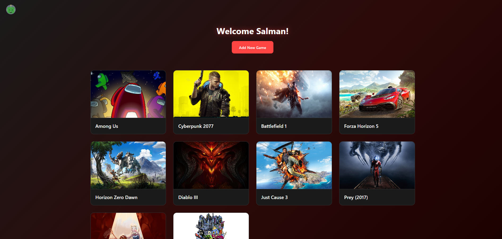

# GameSite

A community CRUD web app for tracking and sharing video game collections and play progress. Users can sign up (including Google OAuth), create a public profile, add games with completion percentage and category, and browse other gamers' profiles, the website integrates with the RAWG games API to enrich game entries and supports user profiles so players can showcase their game libraries and progress.

## Features

- User authentication (email/password + Google OAuth)
- Session management
- CRUD operations for games and user profiles
- Integration with RAWG API for game images
- Public and private profiles
- dicebear API-free for the avatar

## Technologies Used

- JavaScript
- Node.js
- Express
- EJS 
- MongoDB & Mongoose
- bcrypt
- connect-mongo & express-session
- dotenv 
- method-override, morgan
- RAWG API (for game images)
- Google OAuth (google-auth-library)
- dicebear API-free

## Attributions:
- Mr. Omar
- Denis
- Salman

## Next Steps / Stretch Goals

- Add full-text search and filtering of games
- Add Faviorite profiles feature
- Add a leaderboard
- Add nodemailer for forgetting password
